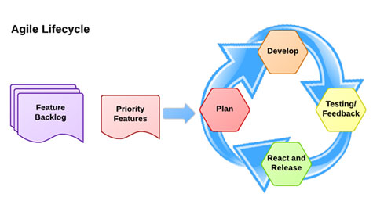
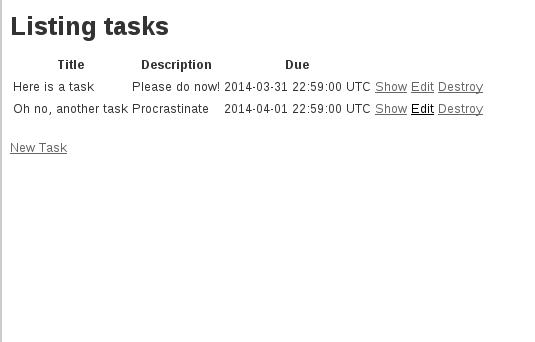
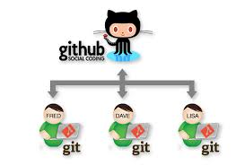

# Continous Delivery: Reliable software develoyment through automation

---

# Jesse Szwedko
## Software Engineer

## ModCloth, Inc.

## j.szwedko@modcloth.com

---

# Agile

## 1 - 2 week cycles
## Continuous feedback

# Presenter Notes
Waterfall is "similar" just with a longer timeline

---

# Continuous Delivery

_Continuous Delivery (CD) is a design practice used in software development to automate and improve the process of software delivery._ - Wikipedia

# Presenter Notes

---

# Outline

## Process Evolution

- Cowboy coding
- Version control
- Local development
- Automated deploys
- Testing
- Automated testing

---

# Tasks Application

Allow the user to create ToDos

- Create
- Read
- Update
- Delete
- List

# Presenter Notes
- Simple CRUD application
- Focus on process
- Show running live

---

# Technology

---

# Feature request: As a user, I should be able to add a description for each todo

---

# Cowboy Coding

---

# Do it live

---

# Do it live example

# Presenter Notes
- Add feature on remote box
- Make syntax error
- Revert to working version manually
- Show broken site (motivate version control and developing locally)
- Branch: initial-implementation

---

# Disadvantages

- Broken code is immediately visible to end user
- Can not debug code (reveal application secrets)
- End user sees a lot of volatility

---

# Version control

Track changes to source code

Centralized

- CVS
- SVN

Decentralized

- Git
- Mercurial

# Presenter Notes
- See source code at any point in time

---

# Distributed version control

---

# Version control example

# Presenter Notes
- Demonstrate commit, log, branch
- Demonstrate needing to see current changes
- git log w/ branches ("alternative timelines")

---

# We will use git & github (distributed)

# Presenter Notes
- Image from http://programmers.stackexchange.com/questions/35074/im-a-subversion-geek-why-should-i-consider-or-not-consider-mercurial-or-git-or
- Demonstrate commit and push to github

---

# Advantages

- Can "deploy" code at any point in history (revert bugs)
- Can see why changes were performed
- Allow for collaboration

# Presenter Notes
- Imagine collaborating on a text document (someone would have to "merge" the changes)

---

# Still, we need to develop in a way where we can experiment

---

# Develop locally

- Develop features, fix bugs, experiment locally
- Push changes to server only after you are done
- (optionally) Use Vagrant to spin up development environment similar to deployment server

# Presenter Notes
- Will not quite be push button, but we will get there

---

# Feature request: As a user, I should be able to add a description for each todo

---

# Developing locally example

# Presenter Notes
- Use vagrant to spin up machine similar to "production" (especially when on Windows)
- Develop adding of description text field
- Push to github
- `git pull` on server
- Broken because of data migration!
- Are not updating JSON builders
- Branch: add-description

---

# Advantages

- Can develop feature in increments, deploy when finished
- Allows for debugging
- Experimentation

# Presenter Notes

---

# Closer, but multi-step deployments introduce risk

---

# Automated deployments

- Specify each step of the deploy as code
- Deterministic
- Idempotent
- Should be able to rollback

---

# Capistrano

Automated deployment tool (primarily used for Ruby applications)

---

# Automated deployment example

# Presenter Notes
- Set up capistrano
- Deploy

---

# Advantages

- Eliminate risk of multi-step deployments
- Automation as documentation

---

# Feature request: As a user, I should be able to add a due date for each todo

# Presenter Notes
- Add due date, but introduce bug with description
- Motivate need for tests

---

# Automated Tests

- Describe what the code *should* do
- Catch regressions
- Force better design (TDD)

---

Enter RSpec

---

# Rspec example

# Presenter notes
- Add view spec for show template to assert fields
- Break test

---

# But what if we forget to run the tests?

---

---

# Continuous integration server

"Build" is triggered by commit to VCS

- Run set-up tasks
- Run tests
- _Build artifacts_

Workflow:

- Develop feature on branch
- Push branch to central repository
- Wait for green build
- Merge and deploy

# Presenter Notes
- Add .travis.yml

---

# Feature request: As a user, I should be able to add a due date for each todo

---

# Full example

# Presenter Notes
- Create branch
- Add due date
- Run tests
- Push to github
- Wait for Travis
- Merge
- Deploy

---

# Advantages

- Running tests happens automatically (you can trust other pull requests)
- Running application under many different environments
- Kick off longer test runs in the background

---

# Mistakes we knew we were making

---

# Conclusion

---

